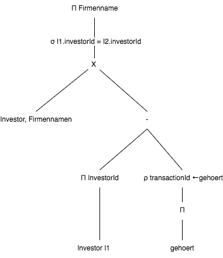

Operatorbaum
============

Aufgabe:
^^^^^^^^

Welcher Investor hat noch keine Transaktion getätigt.

    Operatorbaum

.. code-block:: sql

   SELECT firmenname FROM investor WHERE investor_id=(SELECT investor_id from investor EXCEPT (SELECT gehoert from transaktion));